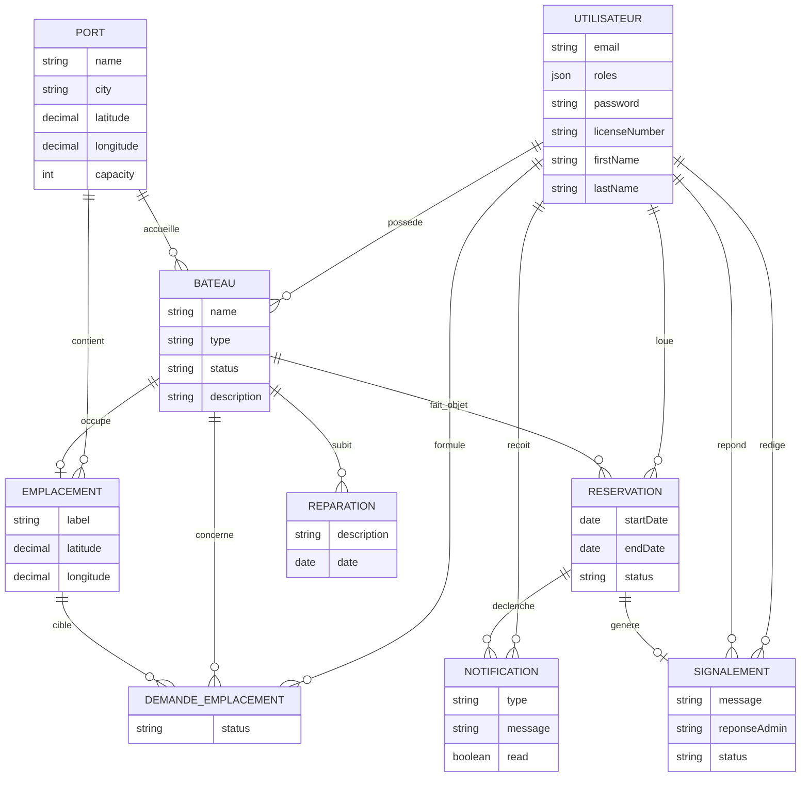
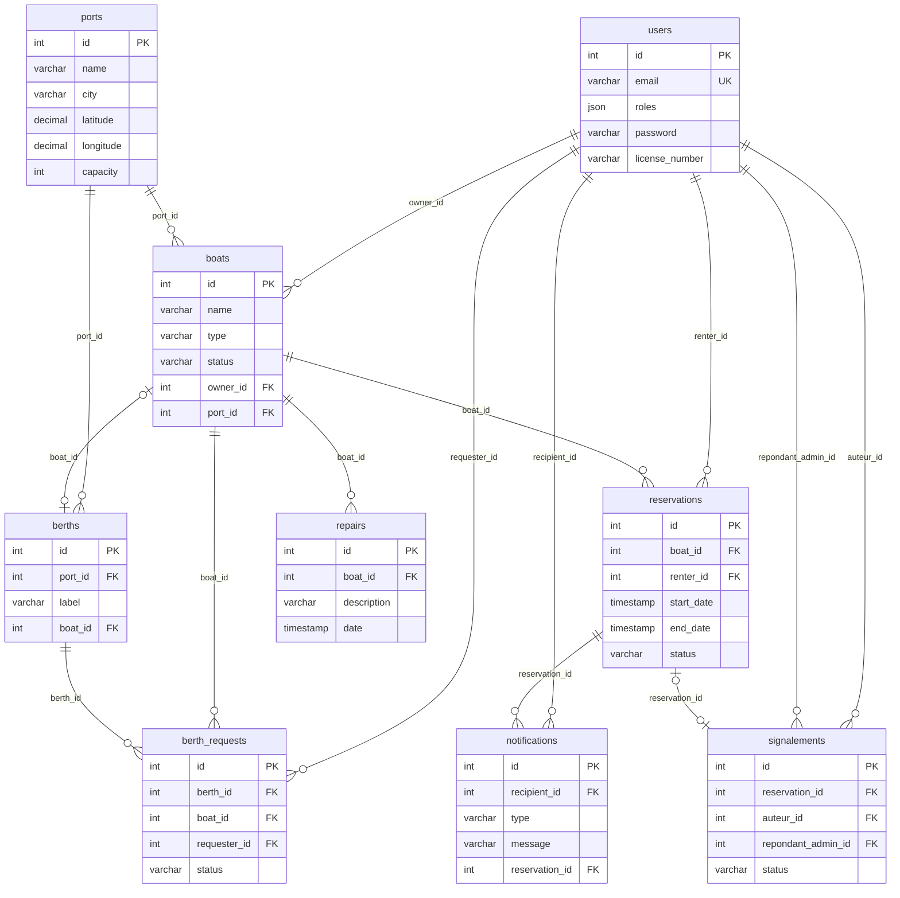

# Modélisation de la Base de Données : NautiLog

**Projet :** NautiLog, gestion de flotte nautique et carte interactive de disponibilité
**Titre visé :** Concepteur Développeur d'Applications (CDA)
**Auteur :** Mell Canac
**Version du document :** 1.0

---

## Sommaire

1. Introduction : démarche MERISE
2. Dictionnaire des données
3. Modèle Conceptuel de Données (MCD)
4. Modèle Logique de Données (MLD)
5. Modèle Physique de Données (MPD)
6. Justifications (sécurité, performance, RGPD)

---

## 1. Introduction : démarche MERISE

### 1.1 Démarche suivie

La base de données de NautiLog a été conçue selon la démarche MERISE, en trois niveaux d'abstraction successifs :

| Niveau | Objectif | Livrable |
|---|---|---|
| Conceptuel (MCD) | Modéliser le métier indépendamment de toute technologie | Entités, associations, cardinalités |
| Logique (MLD) | Traduire le MCD en un schéma relationnel | Tables, clés primaires/étrangères |
| Physique (MPD) | Implémenter le schéma dans un SGBD précis | DDL PostgreSQL, types réels, contraintes |

En pratique, le schéma a été implémenté directement via les entités Doctrine ORM (mapping objet-relationnel), Doctrine se chargeant de générer les migrations SQL correspondantes. Le présent document reconstruit les trois niveaux MERISE a posteriori à partir de ce mapping réel, afin d'en documenter la cohérence.

### 1.2 Périmètre

Le modèle de données compte **9 entités** couvrant l'ensemble du domaine métier : utilisateurs et rôles, flotte de bateaux, ports et emplacements d'amarrage, réservations, réparations, notifications et signalements.

---

## 2. Dictionnaire des données

### 2.1 Table `users`

| Champ | Type | Contraintes | Description |
|---|---|---|---|
| `id` | INT | PK, auto-incrémenté | Identifiant unique |
| `email` | VARCHAR(180) | UNIQUE, NOT NULL | Identifiant de connexion |
| `roles` | JSON | NOT NULL | Tableau de rôles RBAC (`ROLE_ADMIN`, `ROLE_OWNER`, `ROLE_RENTER`) |
| `password` | VARCHAR | NOT NULL | Mot de passe haché (bcrypt/argon2 via Symfony PasswordHasher) |
| `license_number` | VARCHAR(255) | NULL | Numéro de permis bateau, **chiffré** (AES-256-CBC) |
| `first_name` | VARCHAR(100) | NULL | Prénom |
| `last_name` | VARCHAR(100) | NULL | Nom |
| `phone` | VARCHAR(20) | NULL | Téléphone |
| `avatar_url` | VARCHAR(255) | NULL | URL de l'avatar |
| `created_at` | TIMESTAMP | NOT NULL | Date de création du compte |

### 2.2 Table `boats`

| Champ | Type | Contraintes | Description |
|---|---|---|---|
| `id` | INT | PK, auto-incrémenté | Identifiant unique |
| `name` | VARCHAR(150) | NOT NULL | Nom du bateau |
| `type` | VARCHAR(100) | NOT NULL | Type (Voilier, Vedette, Zodiac, etc., libre) |
| `status` | VARCHAR(20) | NOT NULL, défaut `DISPONIBLE` | Statut : `DISPONIBLE` / `LOUÉ` / `EN_RÉPARATION` |
| `owner_id` | INT | FK → `users.id`, NOT NULL | Propriétaire du bateau |
| `port_id` | INT | FK → `ports.id`, NULL | Port d'attache actuel |
| `description` | VARCHAR(2000) | NULL | Description libre |
| `photo_url` | VARCHAR(255) | NULL | URL de la photo uploadée |
| `created_at` | TIMESTAMP | NOT NULL | Date de création |
| `updated_at` | TIMESTAMP | NOT NULL | Date de dernière modification |

### 2.3 Table `ports`

| Champ | Type | Contraintes | Description |
|---|---|---|---|
| `id` | INT | PK, auto-incrémenté | Identifiant unique |
| `name` | VARCHAR(150) | NOT NULL | Nom du port |
| `city` | VARCHAR(100) | NOT NULL | Ville |
| `latitude` | DECIMAL(10,7) | NOT NULL, [-90, 90] | Latitude GPS |
| `longitude` | DECIMAL(10,7) | NOT NULL, [-180, 180] | Longitude GPS |
| `capacity` | INT | NOT NULL, [1, 10] | Capacité d'accueil du port |

### 2.4 Table `berths` (emplacements d'amarrage)

| Champ | Type | Contraintes | Description |
|---|---|---|---|
| `id` | INT | PK, auto-incrémenté | Identifiant unique |
| `port_id` | INT | FK → `ports.id`, NOT NULL | Port auquel appartient l'emplacement |
| `label` | VARCHAR(50) | NOT NULL, UNIQUE avec `port_id` | Nom de l'emplacement (ex. "Ponton A-1") |
| `latitude` | DECIMAL(10,7) | NULL, [-90, 90] | Latitude précise de l'emplacement |
| `longitude` | DECIMAL(10,7) | NULL, [-180, 180] | Longitude précise de l'emplacement |
| `boat_id` | INT | FK → `boats.id`, NULL, UNIQUE | Bateau actuellement amarré (le cas échéant) |

### 2.5 Table `berth_requests` (demandes d'emplacement)

| Champ | Type | Contraintes | Description |
|---|---|---|---|
| `id` | INT | PK, auto-incrémenté | Identifiant unique |
| `berth_id` | INT | FK → `berths.id`, NOT NULL | Emplacement demandé |
| `boat_id` | INT | FK → `boats.id`, NOT NULL | Bateau concerné |
| `requester_id` | INT | FK → `users.id`, NOT NULL | Utilisateur demandeur |
| `status` | VARCHAR(20) | NOT NULL, défaut `EN_ATTENTE` | `EN_ATTENTE` / `APPROUVEE` / `REFUSEE` |
| `created_at` | TIMESTAMP | NOT NULL | Date de la demande |

### 2.6 Table `repairs` (réparations)

| Champ | Type | Contraintes | Description |
|---|---|---|---|
| `id` | INT | PK, auto-incrémenté | Identifiant unique |
| `boat_id` | INT | FK → `boats.id`, NOT NULL | Bateau concerné |
| `description` | VARCHAR(2000) | NOT NULL | Description de la réparation |
| `date` | TIMESTAMP | NOT NULL | Date de la réparation |
| `created_at` | TIMESTAMP | NOT NULL | Date d'enregistrement |

### 2.7 Table `reservations`

| Champ | Type | Contraintes | Description |
|---|---|---|---|
| `id` | INT | PK, auto-incrémenté | Identifiant unique |
| `boat_id` | INT | FK → `boats.id`, NOT NULL | Bateau réservé |
| `renter_id` | INT | FK → `users.id`, NOT NULL | Locataire |
| `start_date` | TIMESTAMP | NOT NULL | Date de début |
| `end_date` | TIMESTAMP | NOT NULL | Date de fin |
| `status` | VARCHAR(20) | NOT NULL, défaut `EN_ATTENTE` | `EN_ATTENTE` / `CONFIRMEE` / `ANNULEE` |
| `created_at` | TIMESTAMP | NOT NULL | Date de création |

### 2.8 Table `notifications`

| Champ | Type | Contraintes | Description |
|---|---|---|---|
| `id` | INT | PK, auto-incrémenté | Identifiant unique |
| `recipient_id` | INT | FK → `users.id`, NOT NULL | Destinataire |
| `type` | VARCHAR(30) | NOT NULL | Type (ex. `RESERVATION_CREEE`, `RGPD_SUPPRESSION`) |
| `message` | VARCHAR(500) | NOT NULL | Message affiché |
| `suggestions` | JSON | NULL | Bateaux alternatifs suggérés (contexte RGPD) |
| `reservation_id` | INT | FK → `reservations.id`, NULL | Réservation liée, le cas échéant |
| `read` | BOOLEAN | NOT NULL, défaut `false` | Statut de lecture |
| `created_at` | TIMESTAMP | NOT NULL | Date de création |

### 2.9 Table `signalements`

| Champ | Type | Contraintes | Description |
|---|---|---|---|
| `id` | INT | PK, auto-incrémenté | Identifiant unique |
| `reservation_id` | INT | FK → `reservations.id`, NOT NULL | Réservation concernée |
| `auteur_id` | INT | FK → `users.id`, NOT NULL | Auteur du signalement |
| `message` | VARCHAR(2000) | NOT NULL | Contenu du signalement |
| `reponse_admin` | VARCHAR(2000) | NULL | Réponse de l'administrateur |
| `repondant_admin_id` | INT | FK → `users.id`, NULL | Administrateur ayant répondu |
| `status` | VARCHAR(20) | NOT NULL, défaut `OUVERT` | `OUVERT` / `TRAITE` |
| `created_at` | TIMESTAMP | NOT NULL | Date de création |
| `responded_at` | TIMESTAMP | NULL | Date de réponse |

---

## 3. Modèle Conceptuel de Données (MCD)



### 3.1 Lecture des cardinalités principales

| Association | Cardinalité | Signification métier |
|---|---|---|
| Utilisateur → Bateau | 1,n | Un propriétaire possède 0 à n bateaux ; un bateau a exactement 1 propriétaire |
| Port → Bateau | 0,n | Un port accueille 0 à n bateaux ; un bateau a 0 ou 1 port d'attache |
| Port → Emplacement | 1,n | Un port contient 0 à n emplacements ; un emplacement appartient à exactement 1 port |
| Bateau → Emplacement | 0,1 | Un bateau occupe au plus 1 emplacement à la fois (relation one-to-one) |
| Bateau → Réservation | 0,n | Un bateau peut faire l'objet de plusieurs réservations (historique) |
| Réservation → Signalement | 0,1 | Une réservation peut donner lieu à au plus un signalement dans le modèle actuel |

---

## 4. Modèle Logique de Données (MLD)

### 4.1 Schéma relationnel (notation textuelle)

```
users (id, email, roles, password, license_number, first_name, last_name, phone, avatar_url, created_at)

boats (id, name, type, status, owner_id, port_id, description, photo_url, created_at, updated_at)
    FK owner_id → users(id)
    FK port_id → ports(id)

ports (id, name, city, latitude, longitude, capacity)

berths (id, port_id, label, latitude, longitude, boat_id)
    FK port_id → ports(id)
    FK boat_id → boats(id)
    UNIQUE (port_id, label)
    UNIQUE (boat_id)

berth_requests (id, berth_id, boat_id, requester_id, status, created_at)
    FK berth_id → berths(id)
    FK boat_id → boats(id)
    FK requester_id → users(id)

repairs (id, boat_id, description, date, created_at)
    FK boat_id → boats(id)

reservations (id, boat_id, renter_id, start_date, end_date, status, created_at)
    FK boat_id → boats(id)
    FK renter_id → users(id)

notifications (id, recipient_id, type, message, suggestions, reservation_id, read, created_at)
    FK recipient_id → users(id)
    FK reservation_id → reservations(id)

signalements (id, reservation_id, auteur_id, message, reponse_admin, repondant_admin_id, status, created_at, responded_at)
    FK reservation_id → reservations(id)
    FK auteur_id → users(id)
    FK repondant_admin_id → users(id)
```

### 4.2 Diagramme relationnel (Mermaid)



---

## 5. Modèle Physique de Données (MPD)

### 5.1 SGBD cible

PostgreSQL 15 (image `postgres:15-alpine`), implémenté via les migrations Doctrine générées à partir du mapping ORM.

### 5.2 Extrait DDL représentatif

```sql
CREATE TABLE users (
    id SERIAL PRIMARY KEY,
    email VARCHAR(180) NOT NULL UNIQUE,
    roles JSON NOT NULL,
    password VARCHAR(255) NOT NULL,
    license_number VARCHAR(255),
    first_name VARCHAR(100),
    last_name VARCHAR(100),
    phone VARCHAR(20),
    avatar_url VARCHAR(255),
    created_at TIMESTAMP NOT NULL
);

CREATE TABLE ports (
    id SERIAL PRIMARY KEY,
    name VARCHAR(150) NOT NULL,
    city VARCHAR(100) NOT NULL,
    latitude NUMERIC(10,7) NOT NULL,
    longitude NUMERIC(10,7) NOT NULL,
    capacity INTEGER NOT NULL
);

CREATE TABLE boats (
    id SERIAL PRIMARY KEY,
    name VARCHAR(150) NOT NULL,
    type VARCHAR(100) NOT NULL,
    status VARCHAR(20) NOT NULL DEFAULT 'DISPONIBLE',
    owner_id INTEGER NOT NULL REFERENCES users(id),
    port_id INTEGER REFERENCES ports(id),
    description VARCHAR(2000),
    photo_url VARCHAR(255),
    created_at TIMESTAMP NOT NULL,
    updated_at TIMESTAMP NOT NULL
);

CREATE TABLE berths (
    id SERIAL PRIMARY KEY,
    port_id INTEGER NOT NULL REFERENCES ports(id),
    label VARCHAR(50) NOT NULL,
    latitude NUMERIC(10,7),
    longitude NUMERIC(10,7),
    boat_id INTEGER UNIQUE REFERENCES boats(id),
    CONSTRAINT uniq_port_label UNIQUE (port_id, label)
);

CREATE TABLE reservations (
    id SERIAL PRIMARY KEY,
    boat_id INTEGER NOT NULL REFERENCES boats(id),
    renter_id INTEGER NOT NULL REFERENCES users(id),
    start_date TIMESTAMP NOT NULL,
    end_date TIMESTAMP NOT NULL,
    status VARCHAR(20) NOT NULL DEFAULT 'EN_ATTENTE',
    created_at TIMESTAMP NOT NULL
);
```

*(DDL représentatif des tables centrales : le schéma complet des 9 tables et de leurs contraintes est disponible dans les migrations Doctrine versionnées du dépôt, `backend/migrations/`.)*

### 5.3 Types de données retenus

| Type Doctrine/PHP | Type PostgreSQL | Justification |
|---|---|---|
| `string` (longueur bornée) | `VARCHAR(n)` | Longueur maximale connue métier (ex. nom de bateau ≤ 150) |
| `string` (longueur libre) | `VARCHAR(2000)` | Champs texte long (description, message) sans être un `TEXT` illimité, pour garder une borne raisonnable |
| `decimal(10,7)` | `NUMERIC(10,7)` | Coordonnées GPS, précision au 7e chiffre décimal (~1cm), évite les erreurs d'arrondi du flottant IEEE 754 |
| `array` (roles) | `JSON` | Structure simple à cardinalité variable, sans besoin de table de jointure dédiée pour un MVP |
| `\DateTimeImmutable` | `TIMESTAMP` | Horodatage sans fuseau (environnement mono-fuseau pour le MVP) |
| `bool` | `BOOLEAN` | Type natif PostgreSQL |

---

## 6. Justifications

### 6.1 Sécurité

| Choix | Justification |
|---|---|
| `license_number` chiffré (AES-256-CBC) plutôt qu'en clair | Donnée à caractère personnel sensible (identifiant officiel), protection appliquée au niveau de la couche persistance via un `EventListener` Doctrine transparent pour le reste du code |
| `password` toujours haché, jamais stocké en clair | Standard de sécurité incontournable, hachage géré par le composant Symfony PasswordHasher |
| Contraintes `NOT NULL`/`UNIQUE` posées en base, pas seulement en validation applicative | Double barrière : la validation Symfony (DTO) empêche les cas invalides côté application, la contrainte SQL empêche toute incohérence même en cas de bug applicatif ou d'accès direct à la base |
| Clé étrangère `owner_id` non nullable sur `boats` | Un bateau orphelin (sans propriétaire) n'a pas de sens métier, la contrainte l'empêche structurellement |

### 6.2 Performance

| Choix | Justification |
|---|---|
| Clé primaire auto-incrémentée (`SERIAL`/`INT`) plutôt qu'UUID | Jointures et index plus légers pour la volumétrie visée (démonstration/MVP), pas de besoin de génération distribuée d'identifiants |
| Contrainte `UNIQUE (port_id, label)` sur `berths` | Empêche les doublons d'emplacement au niveau base, évite une vérification applicative coûteuse à chaque insertion |
| Relation `OneToOne` (`berths.boat_id UNIQUE`) plutôt qu'une table de jointure | Un bateau ne peut occuper qu'un seul emplacement à la fois, modélisé directement dans la contrainte plutôt que vérifié en code |
| `orphanRemoval: true` sur `Boat → Repair` | Suppression en cascade gérée par l'ORM plutôt que par des requêtes manuelles multiples, réduit les allers-retours base |

### 6.3 Conformité RGPD

| Choix | Justification |
|---|---|
| Aucune donnée personnelle dupliquée entre tables | Le nom/email de l'utilisateur n'est jamais recopié dans `boats`/`reservations`/etc., toujours référencé par clé étrangère, une seule source de vérité à corriger/supprimer |
| Suppression en cascade complète possible | Le modèle relationnel (clés étrangères explicites) permet de tracer et supprimer systématiquement toutes les données liées à un utilisateur lors de l'exercice du droit à l'oubli (`DELETE /api/me`) |
| `license_number` chiffré en base | Minimise l'impact d'une éventuelle fuite de la base de données sur une donnée à caractère personnel sensible |
| Pas de champ de géolocalisation sur `users` | Seules les entités métier (`ports`, `berths`) portent des coordonnées GPS, aucune donnée de localisation personnelle collectée sur l'utilisateur lui-même |
