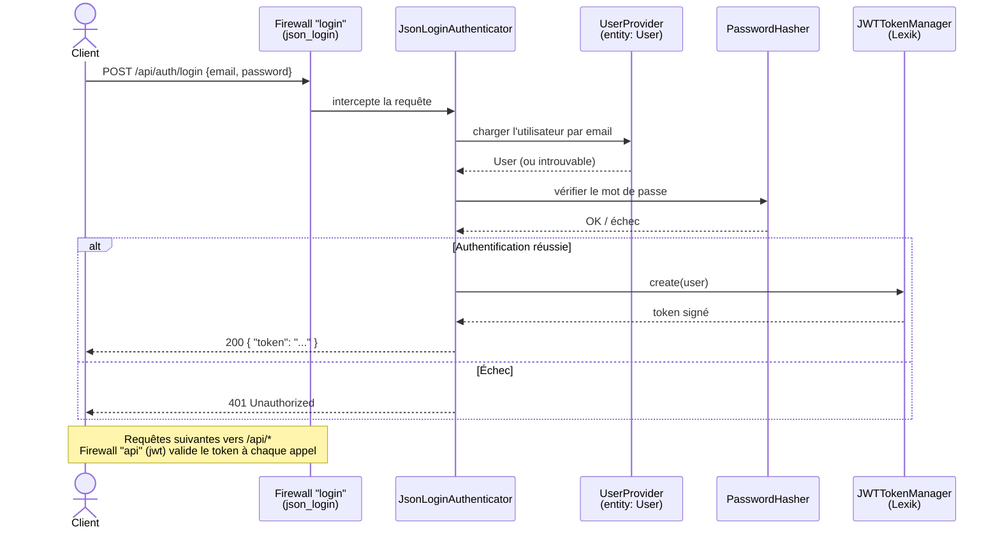
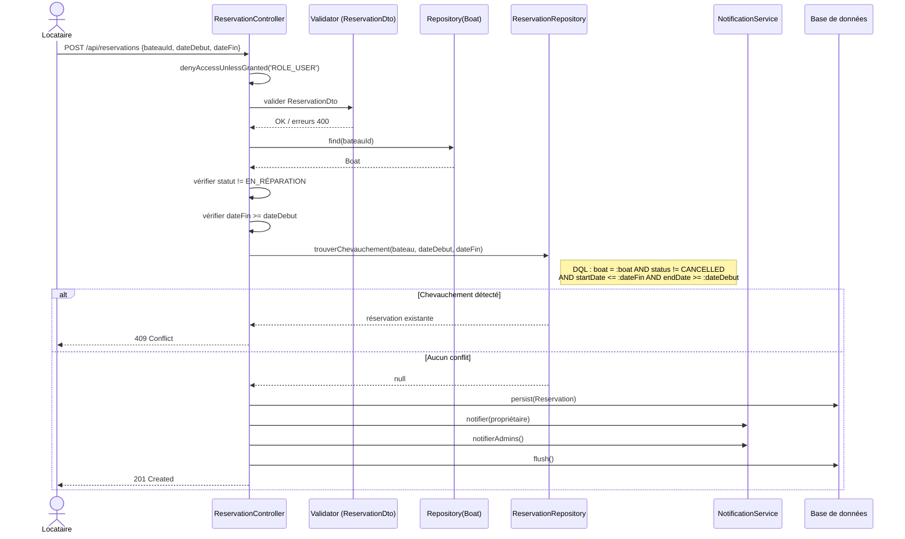
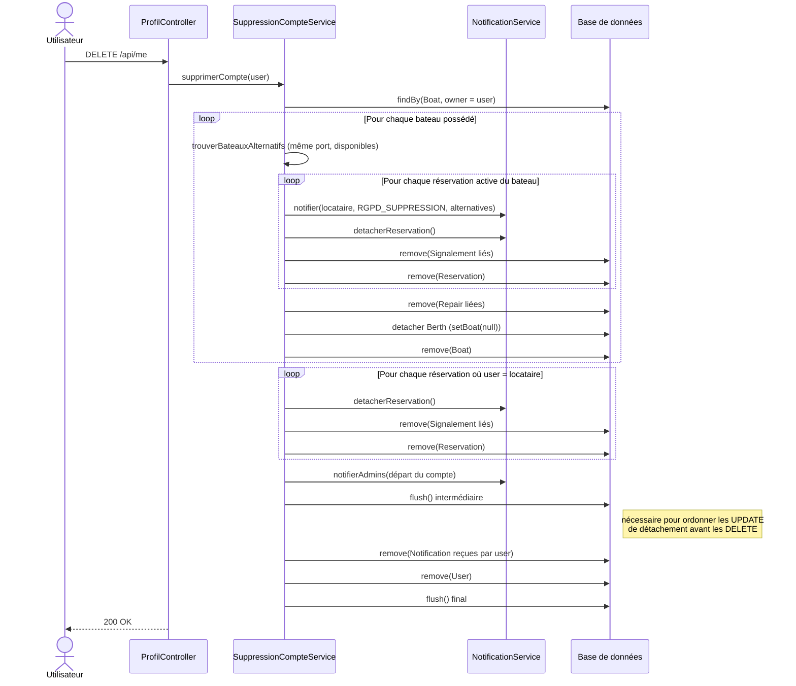
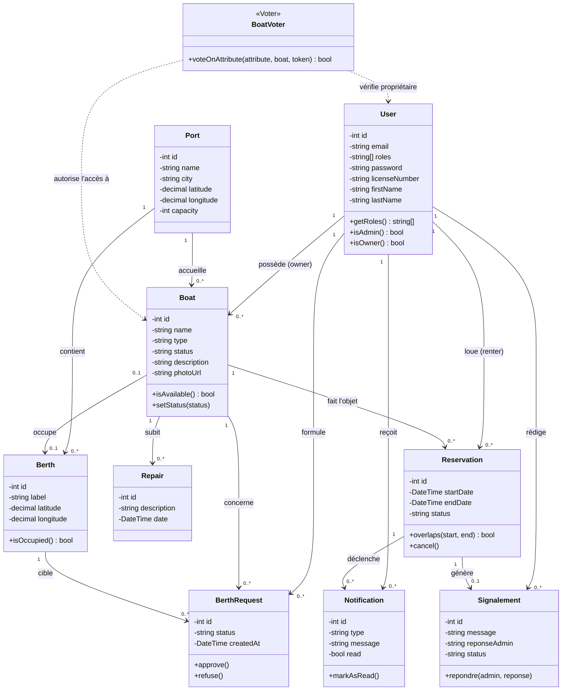

# Conception de l'Application : Diagrammes UML

**Projet :** NautiLog, gestion de flotte nautique et carte interactive de disponibilité
**Titre visé :** Concepteur Développeur d'Applications (CDA)
**Auteur :** Mell Canac
**Version du document :** 1.0

---

## Sommaire

1. Introduction
2. Diagramme de cas d'utilisation
3. Diagrammes de séquence
4. Diagramme de classes

---

## 1. Introduction

Ce document complète la modélisation MERISE de la base de données (DOC-06) par une conception UML de l'application : les cas d'utilisation par rôle, la dynamique des flux métier les plus représentatifs (diagrammes de séquence), et la structure objet du domaine (diagramme de classes). Les diagrammes de séquence ci-dessous ne sont pas une reconstruction théorique : ils reflètent l'implémentation réelle du backend (contrôleurs, services, repositories cités par fichier), afin de rester cohérents avec le code livré.

---

## 2. Diagramme de cas d'utilisation

Les trois rôles applicatifs (`ROLE_ADMIN`, `ROLE_OWNER`, `ROLE_RENTER`) partagent un socle d'actions communes (`ROLE_USER`) et disposent chacun de cas d'utilisation spécifiques, cohérents avec la matrice des droits d'accès du cahier des charges (DOC-03, section 3.2).

```mermaid
flowchart LR
    Locataire([Locataire<br/>ROLE_RENTER])
    Proprietaire([Propriétaire<br/>ROLE_OWNER])
    Admin([Administrateur<br/>ROLE_ADMIN])

    subgraph Commun["Socle commun (ROLE_USER)"]
        UC1((S'authentifier))
        UC2((Consulter bateaux / ports))
        UC3((Gérer son profil))
        UC4((Supprimer son compte - RGPD))
        UC5((Consulter ses notifications))
        UC6((Signaler un problème))
    end

    subgraph Loc["Cas d'utilisation Locataire"]
        UC7((Réserver un bateau disponible))
        UC8((Consulter ses réservations))
        UC9((Annuler une réservation))
    end

    subgraph Prop["Cas d'utilisation Propriétaire"]
        UC10((Gérer sa flotte de bateaux))
        UC11((Consulter historique réparations))
        UC12((Demander un emplacement))
        UC13((Gérer réservations reçues))
    end

    subgraph Adm["Cas d'utilisation Administrateur"]
        UC14((Gérer tous les bateaux et ports))
        UC15((Gérer les emplacements - Berth))
        UC16((Approuver / refuser demande d'emplacement))
        UC17((Passer un bateau en réparation))
        UC18((Gérer les utilisateurs et rôles))
        UC19((Consulter dashboard KPIs))
        UC20((Répondre à un signalement))

    end

    Locataire --> UC1 & UC2 & UC3 & UC4 & UC5 & UC6
    Proprietaire --> UC1 & UC2 & UC3 & UC4 & UC5 & UC6
    Admin --> UC1 & UC2 & UC3 & UC4 & UC5 & UC6

    Locataire --> UC7 & UC8 & UC9
    Proprietaire --> UC10 & UC11 & UC12 & UC13
    Admin --> UC14 & UC15 & UC16 & UC17 & UC18 & UC19 & UC20
```

### 2.1 Lecture

- Les trois rôles héritent d'un socle d'actions commun à tout utilisateur authentifié.
- Le **Propriétaire** ne gère que sa propre flotte (contrôle appliqué par le Voter `BoatVoter`, cf. DOC-03 section 6.2), à l'exception du passage en statut "En réparation", réservé à l'administrateur.
- L'**Administrateur** est le seul à disposer d'une vue transverse (tous bateaux, tous ports, tous utilisateurs) et des actions d'arbitrage (emplacements, signalements).

---

## 3. Diagrammes de séquence

Trois flux représentatifs ont été retenus : l'authentification (socle sécurité), la réservation avec détection de conflit (règle métier centrale), et la suppression de compte RGPD en cascade (conformité réglementaire). Chaque diagramme correspond au code réellement exécuté (fichiers cités).

### 3.1 Authentification JWT

Fichiers : `security.yaml`, `lexik_jwt_authentication.yaml`, `AuthController.php`.

Le firewall Symfony intercepte la requête de connexion avant même d'atteindre le contrôleur applicatif : `AuthController::login()` n'est jamais exécuté sur ce chemin (il documente ce comportement via une exception explicite), toute la logique passe par les gestionnaires du bundle Lexik JWT.

### 3.2 Réservation avec détection de conflit de dates

Fichiers : `ReservationController.php`, `ReservationRepository.php`, `NotificationService.php`.

**Note sur la confirmation :** lors du passage d'une réservation au statut `CONFIRMED` (`PATCH /api/reservations/{id}/statut`), la même méthode `trouverChevauchement()` est ré-invoquée avec un paramètre `excludeId` afin d'exclure la réservation courante de la recherche de conflit.

### 3.3 Suppression de compte : droit à l'oubli RGPD

Fichiers : `ProfilController.php` (`supprimer()`), `SuppressionCompteService.php`, `NotificationService.php`.

---

## 4. Diagramme de classes

Le diagramme de classes reprend les 9 entités Doctrine du domaine (déjà détaillées dans DOC-06, dictionnaire des données), avec leurs attributs principaux, méthodes métier significatives et relations. Il complète le MCD/MLD de DOC-06 par une vue orientée objet (visibilité, méthodes) plutôt que strictement relationnelle.

### 4.1 Note sur les méthodes représentées

Les méthodes indiquées (`overlaps()`, `isAvailable()`, `approve()`...) illustrent la responsabilité métier de chaque classe à titre de conception ; certaines de ces règles sont implémentées côté entité, d'autres côté service ou repository (ex. la détection de chevauchement de dates est portée par `ReservationRepository::trouverChevauchement()`, cf. section 3.2), cohérent avec l'architecture en couches du projet (DTO / Controller / Service / Repository, DOC-03 section 5.3), qui évite de surcharger les entités de logique applicative.

---

## Sources

Ce document a été rédigé à partir d'une lecture directe du code source du backend (`backend/src/Controller/`, `backend/src/Service/`, `backend/src/Repository/`, `backend/config/packages/security.yaml`), afin de garantir la cohérence entre la documentation UML et l'implémentation réelle livrée.
